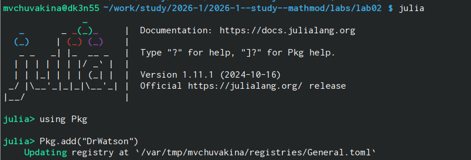
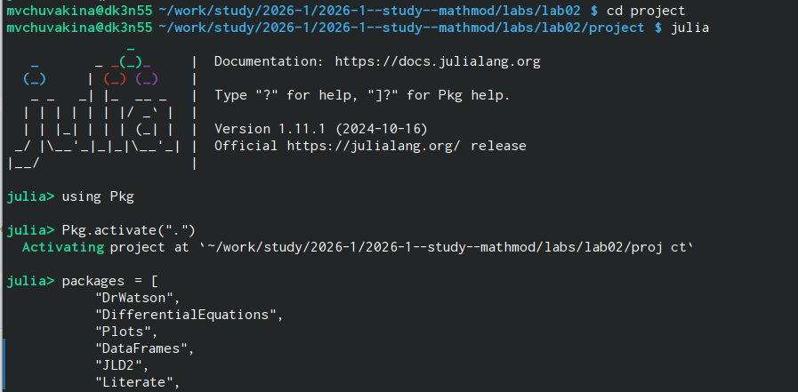
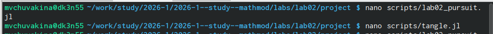
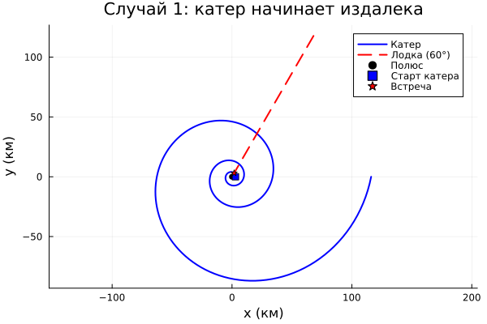
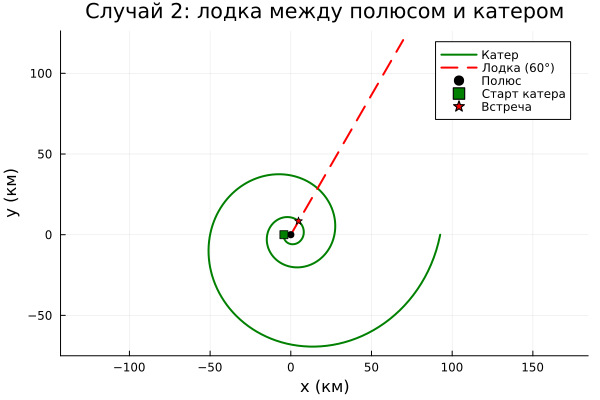
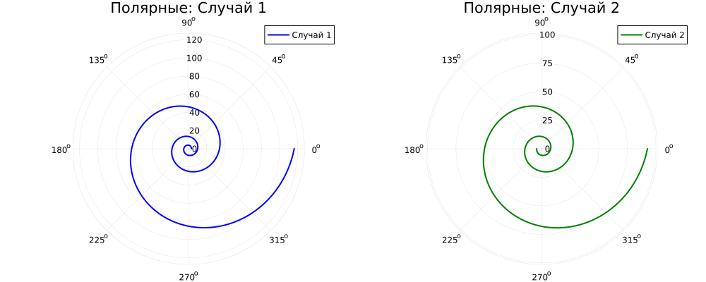

---
## Front matter
lang: ru-RU
title: Лабораторная работа №2
subtitle: Математическое моделирование задачи преследования
author:
  - Чувакина М. В.
institute:
  - Российский университет дружбы народов, Москва, Россия
date: 2 марта 2026

## i18n babel
babel-lang: russian
babel-otherlangs: english

## Formatting pdf
toc: false
toc-title: Содержание
slide_level: 2
aspectratio: 169
section-titles: true
theme: metropolis
header-includes:
 - \metroset{progressbar=frametitle,sectionpage=progressbar,numbering=fraction}
 - \usepackage{fontspec}
 - \setmainfont{FreeSerif}
 - \setsansfont{FreeSans}
 - \setmonofont{FreeMono}
 - \usepackage{polyglossia}
 - \setmainlanguage{russian}
 - \setotherlanguage{english}
---

## Докладчик

:::::::::::::: {.columns align=center}
::: {.column width="70%"}

  * Чувакина Мария Владимировна
  * студентка
  * группа НКНбд-01-23
  * Российский университет дружбы народов
  * [1132236055@rudn.ru](mailto:1132236055@rudn.ru)
  * <https://github.com/mvchuvakina>

:::
::: {.column width="30%"}

:::
::::::::::::::


# Цель работы

Разработать математическую модель задачи преследования, реализовать численное решение на Julia и оформить отчёт с использованием современных инструментов (DrWatson, Literate, Quarto).


# Задание

- Изучить задачу преследования браконьеров береговой охраной

- Вывести дифференциальное уравнение траектории катера

- Рассчитать радиусы перехода для двух случаев расположения катера

- Реализовать численное решение на Julia

- Построить траектории движения катера и лодки

- Найти точки встречи для заданного направления лодки

- Оформить отчёт в формате Quarto


# Параметры варианта 56

Из таблицы вариантов:

Начальное расстояние между катером и лодкой: k = 17.9 км

Отношение скоростей: n = 5.2 (катер в 5.2 раза быстрее лодки)

# Математическая модель

## Система координат

Введём полярную систему координат с центром (полюсом) в точке обнаружения лодки. Полярную ось направим через точку начального расположения катера.

## Два этапа движения катера

Первый этап (прямолинейное движение). Катер движется прямо, пока не окажется на том же расстоянии от полюса, что и лодка.

Для двух возможных начальных положений получаем радиусы перехода:

- Случай 1 (катер дальше от полюса, чем лодка):

x1=kn+1=17.95.2+1=17.96.2=2.887 кмx1​=n+1k​=5.2+117.9​=6.217.9​=2.887 км

# Математическая модель

- Случай 2 (лодка между полюсом и катером):
    
    
x2=kn−1=17.95.2−1=17.94.2=4.262 кмx2​=n−1k​=5.2−117.9​=4.217.9​=4.262 км

Второй этап (спиральное движение). После выхода на нужный радиус катер начинает двигаться так, чтобы его радиальная скорость равнялась скорости лодки $v$.

# Математическая модель

Вывод дифференциального уравнения:

Скорость катера раскладывается на две составляющие:

- Радиальная скорость: $\frac{dr}{dt} = v$ (должна равняться скорости лодки)

- Тангенциальная скорость: $r\frac{d\theta}{dt} = v_\tau$

# Математическая модель

Полная скорость катера: $v_k = n \cdot v$

По теореме Пифагора:

(nv)2=v2+vτ2(nv)2=v2+vτ2​

Окончательное уравнение:

drdθ=r5.103dθdr​=5.103r​

# Программная реализация

Переходим в нужную директорию

{#fig:001 width=70%}

# Программная реализация

Инициализируем проект.

{#fig:002 width=70%}

# Программная реализация

Загрузим необходимые пакеты.

{#fig:003 width=70%}

# Программная реализация

Создадим необходимые скрипты.

{#fig:004 width=70%}

# Программная реализация

## Запуск программы 

```bash

cd ~/work/study/2026-1/2026-1--study--mathmod/labs/lab02/project
julia --project=. scripts/lab02_pursuit.jl
```

# Полученные результаты

Численные результаты

- Случай 1 (катер начинает издалека):

Начальный радиус спирали: 2.89 км

Конечный радиус: 116.06 км

Координаты точки встречи с лодкой (φ=60°): (X₁, Y₁) км

# Полученные результаты

- Случай 2 (лодка между полюсом и катером):

Начальный радиус спирали: 4.26 км

Конечный радиус: 92.57 км

Координаты точки встречи с лодкой (φ=60°): (X₂, Y₂) км

# Полученные результаты

Графики

{#fig:005 width=70%}

# Полученные результаты

{#fig:006 width=70%}

# Полученные результаты

{#fig:007 width=70%}

# Полученные результаты

Анализ результатов

Полученное дифференциальное уравнение $\frac{dr}{d\theta} = \frac{r}{\sqrt{n^2-1}}$ имеет аналитическое решение:

r(θ)=r0eθ/n2−1r(θ)=r0​eθ/n2−1

что подтверждается численными расчётами — траектория является логарифмической спиралью.

Для случая 1 катер проходит большее расстояние (радиус увеличивается до 116 км), но благодаря спиральной траектории гарантированно встречает лодку при любом направлении её движения.

Для случая 2 траектория более «крутая», встреча происходит быстрее и на меньшем удалении от полюса.

Точка встречи зависит от направления движения лодки. В работе для определённости выбрано направление $\varphi = 60^\circ$.

# Генерация отчёта


Генерация отчёта:

```bash

julia --project=. scripts/tangle.jl scripts/lab02_pursuit.jl
cd ../report
make pdf
make docx
```

# Сохранение в Git

```bash

cd ~/work/study/2026-1/2026-1--study--mathmod
git add .
git commit -m "feat(lab02): complete laboratory work with all results"
git push origin lab02
git push gitverse lab02
```

# Выводы

В ходе выполнения лабораторной работы:

- Изучена математическая модель задачи преследования
- Получено дифференциальное уравнение траектории катера
- Найдены аналитические выражения для радиусов перехода
- Реализовано численное решение на языке Julia
- Построены траектории движения катера и лодки для двух случаев
- Определены точки встречи для заданного направления движения лодки
- Освоены инструменты DrWatson.jl и литературного программирования
- Создан отчёт в формате Quarto
- Результаты сохранены в Git и опубликованы на GitHub и GitVerse

