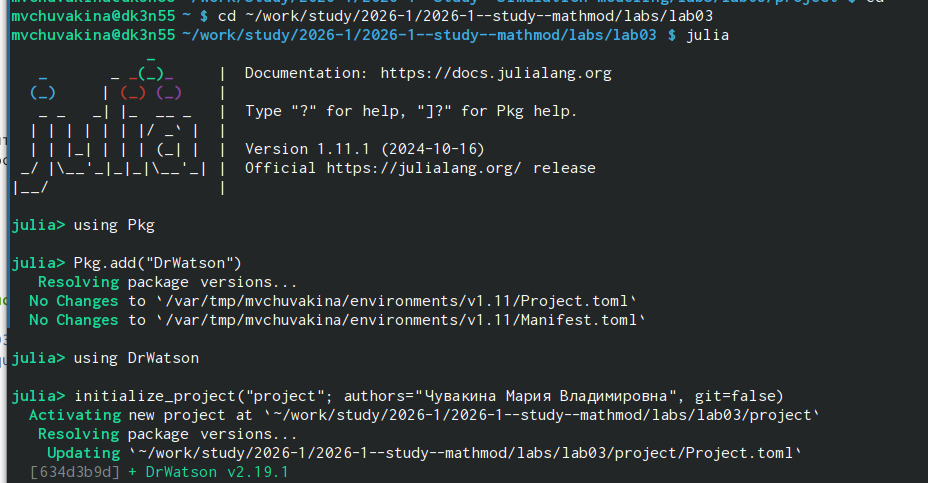
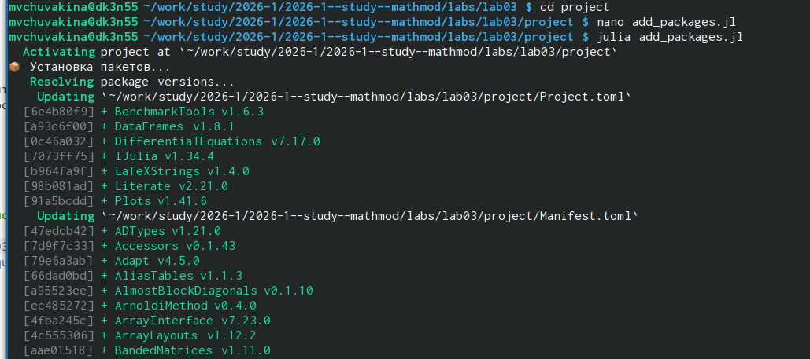
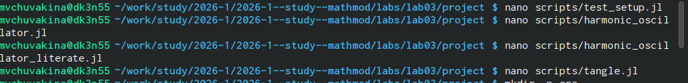

---
## Front matter
lang: ru-RU
title: Лабораторная работа №3
subtitle: "Модель гармонического осциллятора"
author:
  - Чувакина М. В.
institute:
  - Российский университет дружбы народов, Москва, Россия
date: 12 марта 2026

## i18n babel
babel-lang: russian
babel-otherlangs: english

## Formatting pdf
toc: false
toc-title: Содержание
slide_level: 2
aspectratio: 169
section-titles: true
theme: metropolis
header-includes:
 - \metroset{progressbar=frametitle,sectionpage=progressbar,numbering=fraction}
 - \usepackage{fontspec}
 - \setmainfont{FreeSerif}
 - \setsansfont{FreeSans}
 - \setmonofont{FreeMono}
 - \usepackage{polyglossia}
 - \setmainlanguage{russian}
 - \setotherlanguage{english}
---

## Докладчик

:::::::::::::: {.columns align=center}
::: {.column width="70%"}

  * Чувакина Мария Владимировна
  * студентка
  * группа НКНбд-01-23
  * Российский университет дружбы народов
  * [1132236055@rudn.ru](mailto:1132236055@rudn.ru)
  * <https://github.com/mvchuvakina>

:::
::: {.column width="30%"}

:::
::::::::::::::

# 1. Цель работы
Изучить модель гармонического осциллятора, исследовать три режима колебаний (без затухания, с затуханием, вынужденные колебания), освоить методы решения дифференциальных уравнений в Julia и параметрический анализ.

---

# 2. Этапы выполнения

### 2.1. Подготовка рабочего пространства

- Создан каталог `labs/lab03`
- Создан проект DrWatson в `labs/lab03/project`

{#fig:001 width=70%}

# 2. Этапы выполнения

- Установлены пакеты: `DifferentialEquations`, `Plots`, `DataFrames`, `Literate.jl`, `JLD2`, `LaTeXStrings`, `BenchmarkTools`

{#fig:002 width=70%}

# 2. Этапы выполнения

### 2.2. Реализация модели

Созданы следующие скрипты:

{#fig:003 width=70%}

# 2. Этапы выполнения

### 2.3. Параметры варианта №56

| Случай | Уравнение | Начальные условия | Интервал |
|--------|-----------|-------------------|----------|
| 1 | $\ddot{x} + 10.5x = 0$ | $x_0 = -0.7$, $\dot{x}_0 = 0.8$ | $[0, 54]$ |
| 2 | $\ddot{x} + 7\dot{x} + 5x = 0$ | $x_0 = -0.7$, $\dot{x}_0 = 0.8$ | $[0, 54]$ |
| 3 | $\ddot{x} + 0.4\dot{x} + 5.5x = 8\sin(3t)$ | $x_0 = -0.7$, $\dot{x}_0 = 0.8$ | $[0, 54]$ |

# 2. Этапы выполнения

### 2.4. Полученные результаты

#### Случай 1 (без затухания)
- Собственная частота: $\omega_1 = \sqrt{10.5} \approx 3.24$ рад/с
- Период колебаний: $T_1 \approx 1.94$ с
- Амплитуда постоянна (консервативная система)

# 2. Этапы выполнения

#### Случай 2 (с затуханием)
- Собственная частота: $\omega_2 = \sqrt{5} \approx 2.24$ рад/с
- Коэффициент затухания: $\beta_2 = 3.5$
- Режим: апериодический ($\beta_2 > \omega_2$)

# 2. Этапы выполнения

#### Случай 3 (вынужденные колебания)
- Собственная частота: $\omega_3 = \sqrt{5.5} \approx 2.35$ рад/с
- Частота внешней силы: $\omega = 3$ рад/с
- Коэффициент затухания: $\beta_3 = 0.2$

# 2. Этапы выполнения

### 2.5. Параметрическое исследование

Исследовано влияние:
- Коэффициента затухания $\beta \in [0.1, 5.0]$
- Частоты внешней силы $\omega \in [1.0, 5.0]$

**Результаты:**
- Максимальная амплитуда достигается при $\omega \approx 2.5$ рад/с (близко к $\omega_0 \approx 2.35$)
- Увеличение $\beta$ приводит к более быстрому затуханию
- Построена 2D-карта зависимости амплитуды от $\beta$ и $\omega$

# 2. Этапы выполнения

### 2.6. Литературное программирование
- Созданы литературные версии всех скриптов
- Сгенерированы производные форматы через `tangle.jl`
- Выполнены Jupyter notebooks

# 2. Этапы выполнения

### 2.7. Создание отчёта
- Создан файл `report.qmd` со всеми графиками
- Добавлен список литературы (6 источников)
- Отчёт скомпилирован в PDF

# 2. Этапы выполнения

### 2.8. Отправка на GitVerse
- Код отправлен в репозиторий
- Создан релиз `lab01-v56` с отчётом и графиками

---

# 4. Выводы

В ходе выполнения лабораторной работы:

1. **Реализована модель гармонического осциллятора** для трёх режимов колебаний.
2. **Получены графики** $x(t)$ и фазовые портреты для всех случаев.
3. **Проведён анализ** динамики системы при различных параметрах.
4. **Освоены методы** решения дифференциальных уравнений в Julia.
5. **Созданы литературные скрипты** с использованием Literate.jl.
6. **Сгенерированы производные форматы** (чистый код, Jupyter notebooks, Quarto).
7. **Подготовлен отчёт** в формате PDF.
8. **Результаты отправлены** на GitVerse и оформлены в виде релиза.

Работа позволила на практике освоить методы математического моделирования колебательных систем и закрепить навыки работы с языком Julia.

