# Введение

Гармонический осциллятор — одна из важнейших моделей в физике и математике, описывающая колебательные системы. Уравнение движения имеет вид:

$$\ddot{x} + 2\beta\dot{x} + \omega_0^2 x = f(t)$$

где:
* $\beta$ — коэффициент затухания,
* $\omega_0$ — собственная частота,
* $f(t)$ — внешняя вынуждающая сила.

В данной работе исследуются три случая:
1. Свободные колебания без затухания
2. Затухающие колебания
3. Вынужденные колебания под действием внешней силы

# Мой вариант

Номер варианта: **56** (определён по формуле (Sn mod 70)+1, где Sn = 1132236055)

**Параметры варианта:**

| Случай | Уравнение | Начальные условия | Интервал |
|--------|-----------|-------------------|----------|
| 1 (без затухания) | $\ddot{x} + 10.5x = 0$ | $x_0 = -0.7$, $\dot{x}_0 = 0.8$ | $t \in [0, 54]$ |
| 2 (с затуханием) | $\ddot{x} + 7\dot{x} + 5x = 0$ | $x_0 = -0.7$, $\dot{x}_0 = 0.8$ | $t \in [0, 54]$ |
| 3 (с затуханием и силой) | $\ddot{x} + 0.4\dot{x} + 5.5x = 8\sin(3t)$ | $x_0 = -0.7$, $\dot{x}_0 = 0.8$ | $t \in [0, 54]$ |

Шаг интегрирования: $0.05$

# Результаты моделирования

## Случай 1: Свободные колебания без затухания

Уравнение: $\ddot{x} + 10.5x = 0$

Собственная частота: $\omega_1 = \sqrt{10.5} \approx 3.24$ рад/с  
Период колебаний: $T_1 = 2\pi/\omega_1 \approx 1.94$ с

### График зависимости x(t)
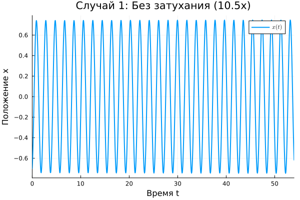{#fig:case1_dynamics width=100%}

На графике наблюдаются незатухающие гармонические колебания с постоянной амплитудой, что соответствует консервативной системе без потерь энергии.

### Фазовый портрет
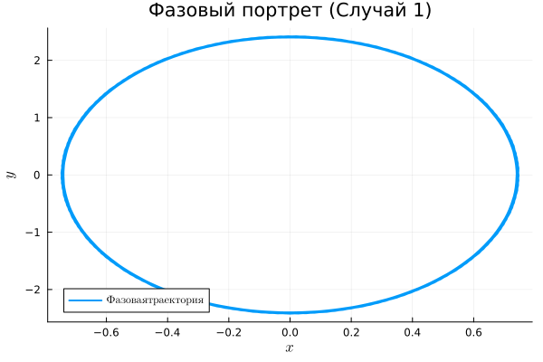{#fig:case1_phase width=100%}

Фазовый портрет представляет собой эллипс, что характерно для гармонического осциллятора без затухания.

## Случай 2: Затухающие колебания

Уравнение: $\ddot{x} + 7\dot{x} + 5x = 0$

Собственная частота: $\omega_2 = \sqrt{5} \approx 2.24$ рад/с  
Коэффициент затухания: $\beta_2 = 3.5$

Так как $\beta_2 > \omega_2$, режим колебаний — **апериодический** (сильное затухание).

### График зависимости x(t)
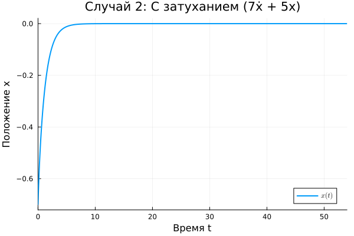{#fig:case2_dynamics width=100%}

На графике видно, что колебания быстро затухают, система возвращается в положение равновесия без перерегулирования.

### Фазовый портрет
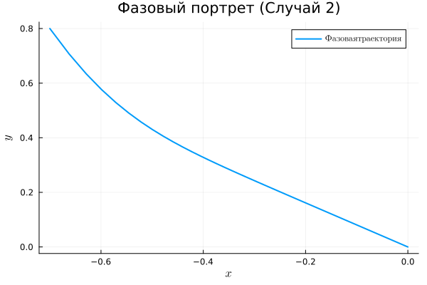{#fig:case2_phase width=100%}

Фазовая траектория "скручивается" к началу координат, что характерно для диссипативных систем.

## Случай 3: Вынужденные колебания

Уравнение: $\ddot{x} + 0.4\dot{x} + 5.5x = 8\sin(3t)$

Собственная частота: $\omega_3 = \sqrt{5.5} \approx 2.35$ рад/с  
Частота внешней силы: $\omega_{\text{вн}} = 3$ рад/с  
Коэффициент затухания: $\beta_3 = 0.2$

### График зависимости x(t)
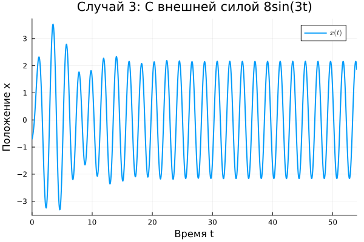{#fig:case3_dynamics width=100%}

На графике наблюдаются вынужденные колебания с частотой внешней силы. Амплитуда колебаний устанавливается после переходного процесса.

### Фазовый портрет
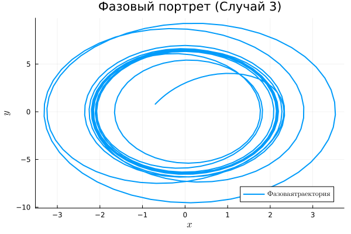{#fig:case3_phase width=100%}

Фазовый портрет имеет сложную форму, характерную для вынужденных колебаний.

## Сводный график
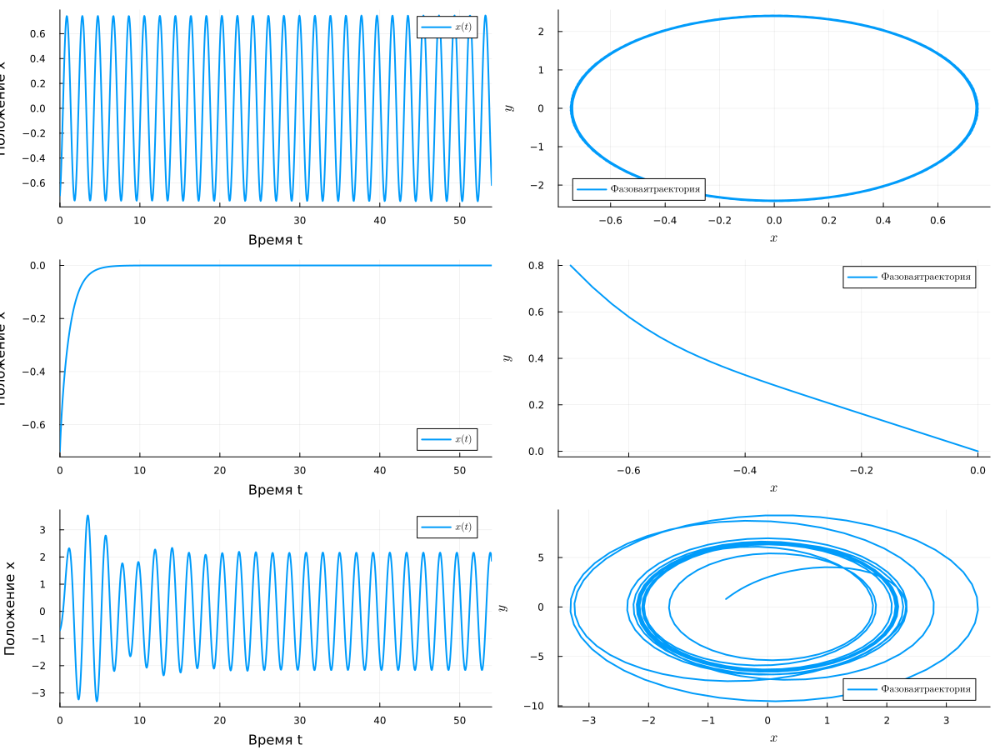{#fig:combined width=100%}

# Параметрическое исследование

## Влияние коэффициента затухания $\beta$

Исследовалось влияние коэффициента затухания $\beta$ на поведение системы при фиксированных остальных параметрах ($\omega_0^2 = 5.5$, $F_0 = 8$, $\omega = 3$).

Значения $\beta$: $0.1$, $0.4$, $1.0$, $2.0$, $5.0$

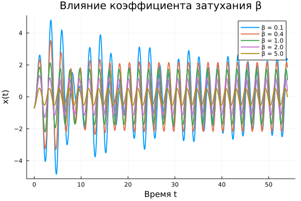{#fig:beta_param width=100%}

**Анализ:**
- При малых $\beta$ ($0.1$, $0.4$) наблюдаются ярко выраженные колебания
- При увеличении $\beta$ колебания затухают быстрее
- При $\beta = 5.0$ система становится апериодической

## Влияние частоты внешней силы $\omega$

Исследовалось влияние частоты внешней силы $\omega$ при фиксированных $\beta = 0.4$, $\omega_0^2 = 5.5$, $F_0 = 8$.

Значения $\omega$: $1.0$, $2.0$, $2.5$, $3.0$, $3.5$, $4.0$, $5.0$

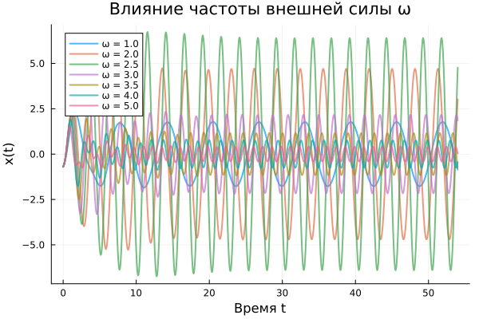{#fig:omega_param width=100%}

### Резонансная кривая
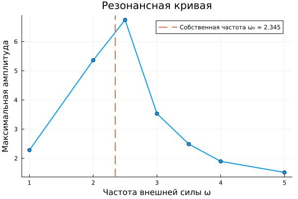{#fig:resonance width=100%}

**Анализ:**
- Максимальная амплитуда достигается при $\omega \approx 2.5$ рад/с
- Собственная частота системы $\omega_0 \approx 2.35$ рад/с
- Наблюдается резонансный пик вблизи собственной частоты

## 2D-карта амплитуд
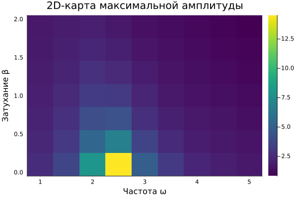{#fig:2d_map width=100%}

Двумерное сканирование по параметрам $\beta$ и $\omega$ позволяет наглядно увидеть области резонанса.

## Сводный график параметрического исследования
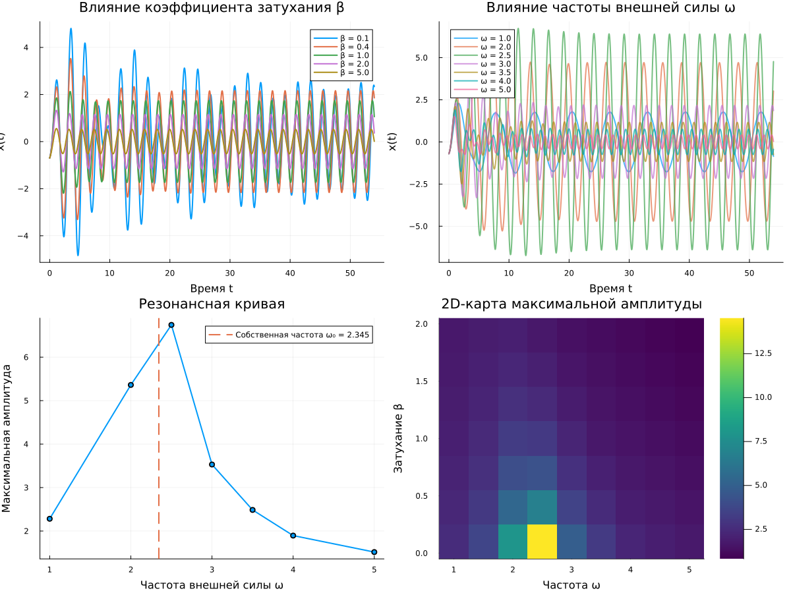{#fig:parametric_combined width=100%}

# Выводы

В ходе выполнения лабораторной работы:

1. **Реализована модель гармонического осциллятора** для трёх случаев:
   * Свободные колебания без затухания
   * Затухающие колебания
   * Вынужденные колебания

2. **Получены графики** $x(t)$ и фазовые портреты для всех случаев.

3. **Проведён анализ**:
   * Для случая 1: частота $\omega_1 \approx 3.24$ рад/с, период $T_1 \approx 1.94$ с
   * Для случая 2: режим апериодического затухания ($\beta_2 = 3.5 > \omega_2 = 2.24$)
   * Для случая 3: вынужденные колебания с частотой $\omega_{\text{вн}} = 3$ рад/с

4. **Параметрическое исследование** показало:
   * Увеличение коэффициента затухания $\beta$ приводит к более быстрому затуханию колебаний
   * Резонанс наблюдается при $\omega \approx 2.5$ рад/с, что близко к собственной частоте $\omega_0 \approx 2.35$ рад/с
   * Построена 2D-карта зависимости максимальной амплитуды от $\beta$ и $\omega$

5. **Освоены методы** решения дифференциальных уравнений в Julia с использованием пакета `DifferentialEquations.jl`.

6. **Подготовлен отчёт** в формате PDF, включающий все полученные графики и анализ.

# Приложение: Код программы

Основные скрипты находятся в директории `project/scripts/`:
- `harmonic_oscillator.jl` — базовый скрипт
- `harmonic_oscillator_literate.jl` — литературная версия
- `harmonic_parametric.jl` — параметрическое исследование
- `harmonic_parametric_literate.jl` — литературная версия параметрического исследования
- `tangle.jl` — генератор производных форматов
- `test_setup.jl` — проверка установки

Все скрипты доступны в репозитории на GitVerse.

# Список литературы {.unnumbered}

1. Калиткин Н.Н. Численные методы. — М.: Наука, 1978. — 512 с.

2. Тихонов А.Н., Самарский А.А. Уравнения математической физики. — М.: Наука, 1977. — 736 с.

3. Хайрер Э., Ваннер Г. Решение обыкновенных дифференциальных уравнений. Жесткие и дифференциально-алгебраические задачи. — М.: Мир, 1999. — 685 с.

4. Королькова А.В., Кулябов Д.С. Имитационное моделирование. Практикум. — М.: РУДН, 2025. — 148 с.
