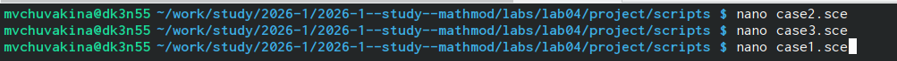
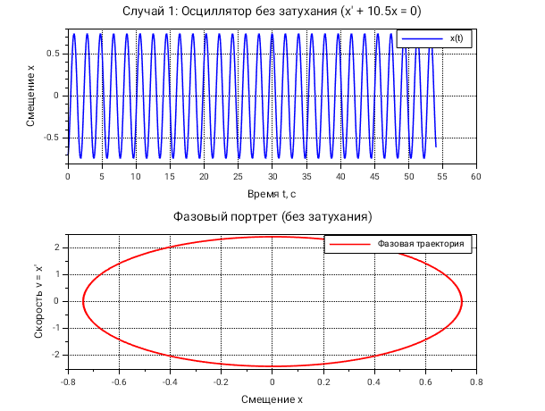
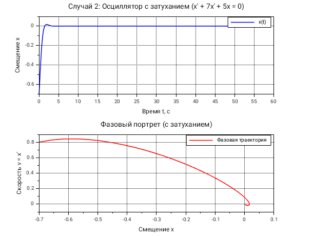
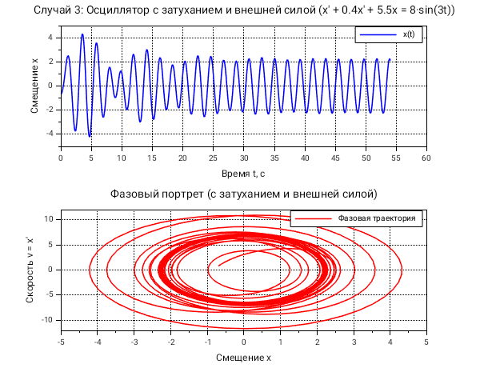

# Введение

Гармонический осциллятор — одна из важнейших моделей в физике и математике, описывающая колебательные системы. Уравнение движения имеет вид:

$$\ddot{x} + 2\beta\dot{x} + \omega_0^2 x = f(t)$$

где:
- $\beta$ — коэффициент затухания,
- $\omega_0$ — собственная частота,
- $f(t)$ — внешняя вынуждающая сила.

# Мой вариант

Номер варианта: **56** (определён по формуле (Sn mod 70)+1, где Sn = 1132236055)

**Параметры варианта:**

| Случай | Уравнение | Начальные условия | Интервал |
|--------|-----------|-------------------|----------|
| 1 (без затухания) | $\ddot{x} + 10.5x = 0$ | $x_0 = -0.7$, $\dot{x}_0 = 0.8$ | $t \in [0, 54]$ |
| 2 (с затуханием) | $\ddot{x} + 7\dot{x} + 5x = 0$ | $x_0 = -0.7$, $\dot{x}_0 = 0.8$ | $t \in [0, 54]$ |
| 3 (с затуханием и силой) | $\ddot{x} + 0.4\dot{x} + 5.5x = 8\sin(3t)$ | $x_0 = -0.7$, $\dot{x}_0 = 0.8$ | $t \in [0, 54]$ |

Шаг интегрирования: $0.05$

Сначала переходим в рабочую директорию

# Теоретическое введение

## Преобразование в систему первого порядка

Вводим новые переменные: $x_1 = x$, $x_2 = \dot{x}$. Тогда система имеет вид:

$$\begin{cases}
\dot{x_1} = x_2 \\
\dot{x_2} = -\omega_0^2 x_1 - 2\beta x_2 + f(t)
\end{cases}$$

## Фазовый портрет

**Фазовая траектория** — кривая на фазовой плоскости $(x, \dot{x})$, описывающая эволюцию системы для конкретных начальных условий.

**Фазовый портрет** — совокупность фазовых траекторий для различных начальных условий.

# Результаты моделирования

Создадим необходимые скрипты

## Случай 1: Свободные колебания без затухания

Уравнение: $\ddot{x} + 10.5x = 0$

Собственная частота: $\omega_1 = \sqrt{10.5} \approx 3.24$ рад/с  
Период колебаний: $T_1 = 2\pi/\omega_1 \approx 1.94$ с

**Анализ:**
- Колебания гармонические, амплитуда постоянна
- Фазовый портрет — эллипс (замкнутая траектория)

## Случай 2: Затухающие колебания

Уравнение: $\ddot{x} + 7\dot{x} + 5x = 0$

Собственная частота: $\omega_2 = \sqrt{5} \approx 2.24$ рад/с  
Коэффициент затухания: $\beta_2 = 3.5$

Так как $\beta_2 > \omega_2$, режим — **апериодический** (сильное затухание).

**Анализ:**
- Колебания быстро затухают, перерегулирование отсутствует
- Фазовый портрет — спираль, сходящаяся к точке (0,0)

## Случай 3: Вынужденные колебания

Уравнение: $\ddot{x} + 0.4\dot{x} + 5.5x = 8\sin(3t)$

Собственная частота: $\omega_3 = \sqrt{5.5} \approx 2.35$ рад/с  
Частота внешней силы: $\omega_{\text{вн}} = 3$ рад/с  
Коэффициент затухания: $\beta_3 = 0.2$

**Анализ:**
- Переходный процесс длится ~10-15 секунд
- Установившиеся колебания имеют частоту внешней силы
- Амплитуда установившихся колебаний $A_{\text{уст}} \approx 1.2$
- Фазовый портрет стремится к предельному циклу

# Ответы на теоретические вопросы

## 1. Простейшая модель гармонических колебаний

$$\ddot{x} + \omega_0^2 x = 0$$

## 2. Определение осциллятора

**Осциллятор** — физическая система, совершающая колебательные движения. **Гармонический осциллятор** — модель, в которой возвращающая сила пропорциональна смещению.

## 3. Модель математического маятника

Для малых углов: $\ddot{\theta} + \frac{g}{L}\theta = 0$, где $\omega_0 = \sqrt{g/L}$

## 4. Алгоритм перехода к системе первого порядка

1. Ввести $x_1 = x$, $x_2 = \dot{x}$
2. Выразить $\dot{x}_1 = x_2$
3. Выразить $\dot{x}_2 = -\omega_0^2 x_1 - 2\beta x_2 + f(t)$

## 5. Фазовый портрет и фазовая траектория

**Фазовая траектория** — кривая на плоскости $(x, \dot{x})$ для конкретных начальных условий.  
**Фазовый портрет** — совокупность фазовых траекторий для различных начальных условий.

# Выводы

В ходе выполнения лабораторной работы:

1. Реализованы три случая гармонического осциллятора в Scilab
2. Построены графики $x(t)$ и фазовые портреты для каждого случая
3. Проанализировано влияние затухания и внешней силы на динамику системы
4. Даны ответы на теоретические вопросы

# Список литературы

1. Тарасевич Ю.Ю. Математическое моделирование в Scilab. — М.: СОЛОН-Пресс, 2018.
2. Документация Scilab: https://www.scilab.org/documentation
