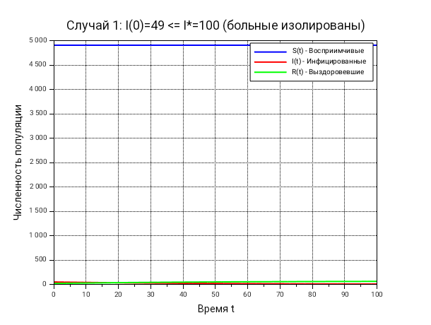
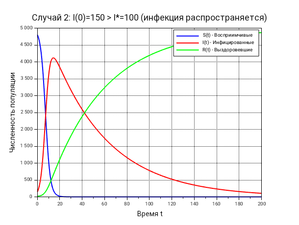

---
## Front matter
lang: ru-RU
title: Лабораторная работа №6
subtitle: "Задача об эпидемии"
author:
  - Чувакина М. В.
institute:
  - Российский университет дружбы народов, Москва, Россия
date: 28 апреля 2026

## i18n babel
babel-lang: russian
babel-otherlangs: english

## Formatting pdf
toc: false
toc-title: Содержание
slide_level: 2
aspectratio: 169
section-titles: true
theme: metropolis

---

## Докладчик

:::::::::::::: {.columns align=center}
::: {.column width="70%"}

  * Чувакина Мария Владимировна
  * студентка
  * группа НКНбд-01-23
  * Российский университет дружбы народов
  * [1132236055@rudn.ru](mailto:1132236055@rudn.ru)
  * <https://github.com/mvchuvakina>

:::
::: {.column width="30%"}

:::
::::::::::::::

# 1. Цель работы

Изучить математическую модель распространения эпидемии с пороговым значением
I*, построить графики динамики численности групп S(t), I(t), R(t).

---

# 2. Задание

1. Создать рабочий каталог для кода.
2. Реализовать математическую модель эпидемии в Scilab.
3. Построить графики для двух случаев:
   - случай а) I(0) ≤ I*
   - случай б) I(0) > I*
4. Проанализировать полученные результаты.

---

# 3. Параметры модели (Вариант 56)

- $N = 4973$ — общая численность населения
- $S(0) = 4905$, $I(0) = 49$, $R(0) = 19$
- $\alpha = 0.01$ — коэффициент заболеваемости
- $\beta = 0.02$ — коэффициент выздоровления
- $I^* = 100$ — критическое значение

---

# 4. Математическая модель

$$
\frac{dS}{dt} = 
\begin{cases}
-\alpha \dfrac{S I}{I^*}, & I(t) > I^* \\[10pt]
0, & I(t) \leq I^*
\end{cases}
$$

$$
\frac{dI}{dt} = 
\begin{cases}
\alpha \dfrac{S I}{I^*} - \beta I, & I(t) > I^* \\[10pt]
-\beta I, & I(t) \leq I^*
\end{cases}
$$

$$
\frac{dR}{dt} = \beta I
$$

---

# 5. Пороговое значение I*

Критическое значение $I^* = 100$ является порогом:

- **При $I(0) \leq I^*$** — больные изолированы, эпидемия не распространяется
- **При $I(0) > I^*$** — инфекция распространяется, возникает вспышка эпидемии

---

# 6. Случай 1: I(0) = 49 ≤ I* = 100

**Условие:** больные изолированы

**Система:**
$$
\frac{dS}{dt} = 0, \quad \frac{dI}{dt} = -\beta I, \quad \frac{dR}{dt} = \beta I
$$

**Результат:**
- $S(t) = 4905$ (постоянна)
- $I(t)$ экспоненциально убывает
- $R(t)$ растёт и стремится к 68

---

# 6.1 График для случая 1

---

# 7. Случай 2: I(0) = 150 > I* = 100

**Условие:** инфекция распространяется

**Система:**
$$
\frac{dS}{dt} = -\alpha \frac{S I}{I^*}, \quad
\frac{dI}{dt} = \alpha \frac{S I}{I^*} - \beta I, \quad
\frac{dR}{dt} = \beta I
$$

**Результат:**
- $S(t)$ убывает
- $I(t)$ имеет пик $\approx 120$ на времени $\approx 15$
- $R(t)$ растёт и стремится к $\approx 323$

---

# 7.1 График для случая 2

---

# 8. Сравнительный анализ

| Показатель | Случай 1 | Случай 2 |
|------------|----------|----------|
| Максимум I(t) | 49 (убывает) | $\approx 120$ |
| Время пика | — | $\approx 15$ |
| Конечное S | $\approx 4905$ | $\approx 4650$ |
| Конечное R | $\approx 68$ | $\approx 323$ |

---

# 9. Выводы

1. Критическое значение $I^* = 100$ является порогом
2. При $I(0) \leq I^*$ эпидемия затухает без массового распространения
3. При $I(0) > I^*$ возникает вспышка эпидемии с пиком заболеваемости
4. Демонстрируется важность раннего выявления и изоляции заболевших
