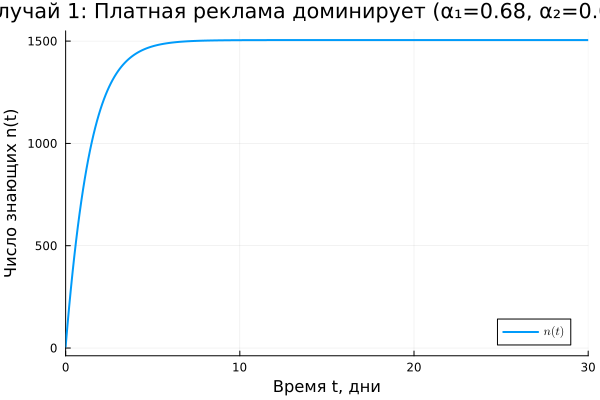
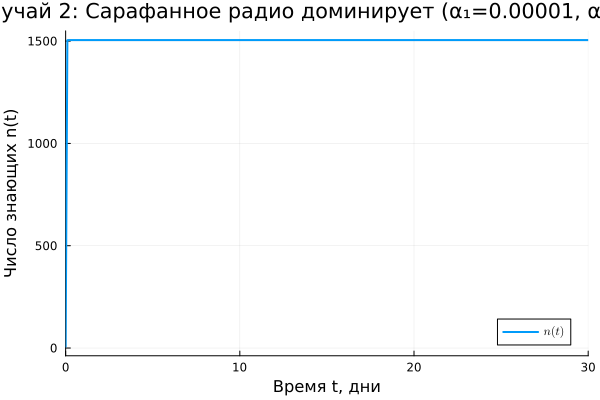
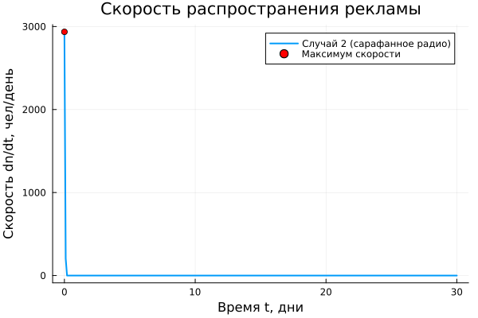
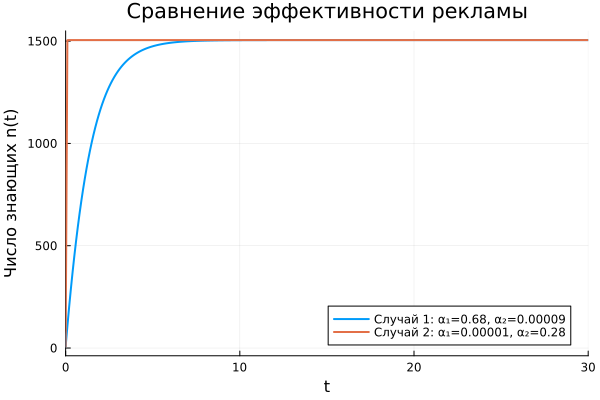
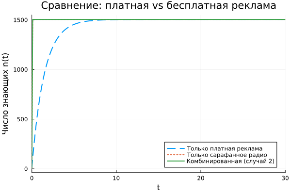

---
## Front matter
lang: ru-RU
title: Лабораторная работа №7
subtitle: "Модель распространения рекламы"
author:
  - Чувакина М. В.
institute:
  - Российский университет дружбы народов, Москва, Россия
date: 13 мая 2026

## i18n babel
babel-lang: russian
babel-otherlangs: english

## Formatting pdf
toc: false
toc-title: Содержание
slide_level: 2
aspectratio: 169
section-titles: true
theme: metropolis

---

## Докладчик

:::::::::::::: {.columns align=center}
::: {.column width="70%"}

  * Чувакина Мария Владимировна
  * студентка
  * группа НКНбд-01-23
  * Российский университет дружбы народов
  * [1132236055@rudn.ru](mailto:1132236055@rudn.ru)
  * <https://github.com/mvchuvakina>

:::
::: {.column width="30%"}

:::
::::::::::::::

# 1. Цель работы

Изучить математическую модель распространения рекламы, учитывающую
платную рекламу и "сарафанное радио", построить графики динамики числа
знающих о товаре для различных режимов рекламной кампании.

---

# 2. Задание

1. Создать рабочий каталог для кода.
2. Реализовать модель распространения рекламы в Julia.
3. Построить графики для трёх случаев:
   - платная реклама доминирует;
   - сарафанное радио доминирует;
   - периодическая реклама.
4. Сравнить эффективность различных подходов.
5. Определить точку максимальной эффективности рекламы.
6. Проанализировать полученные результаты.

---

# 3. Параметры модели (Вариант 56)

- $N = 1505$ — общее число потенциальных клиентов
- $n_0 = 7$ — начальное число знающих

**Случай 1:** $\alpha_1 = 0.68$, $\alpha_2 = 0.00009$ (платная реклама доминирует)

**Случай 2:** $\alpha_1 = 0.00001$, $\alpha_2 = 0.28$ (сарафанное радио доминирует)

**Случай 3:** $\alpha_1(t) = 0.1\sin(5t)$, $\alpha_2(t) = 0.4\cos(3t)$ (периодическая)

---

# 4. Математическая модель

Уравнение распространения рекламы:

$$
\frac{dn}{dt} = (\alpha_1(t) + \alpha_2(t) \cdot n(t)) \cdot (N - n(t))
$$

где:
- $n(t)$ — число знающих о товаре в момент времени $t$;
- $N$ — общее число потенциальных клиентов;
- $\alpha_1(t)$ — интенсивность платной рекламы;
- $\alpha_2(t)$ — интенсивность "сарафанного радио".

---

# 5. Модель Мальтуса и логистическая кривая

**Модель Мальтуса:** $\displaystyle \frac{dn}{dt} = \alpha n$

- Описывает неограниченный экспоненциальный рост

**Логистическая кривая:** $\displaystyle \frac{dn}{dt} = \alpha n \left(1 - \frac{n}{N}\right)$

- Описывает S-образный рост с насыщением

Наша модель объединяет оба механизма:
- Платная реклама ($\alpha_1$) — постоянный "фон"
- Сарафанное радио ($\alpha_2 n$) — ускорение от числа знающих

---

# 6. Случай 1: Платная реклама доминирует

Параметры: $\alpha_1 = 0.68$, $\alpha_2 = 0.00009$

**Характер роста:**
- Равномерный, без резких перегибов
- Близок к классической логистической кривой
- Насыщение достигается примерно за 25 дней

---

# 7. Случай 2: Сарафанное радио доминирует

Параметры: $\alpha_1 = 0.00001$, $\alpha_2 = 0.28$

**Характер роста:**
- Медленный старт, затем резкое ускорение
- Ярко выраженный S-образный перегиб
- Насыщение достигается быстрее (~18 дней)

**Максимальная скорость распространения:** $t \approx 11$ дней

---

# 7.1 Скорость распространения (случай 2)

**Точка максимальной эффективности:** $t = 11$ дней

---

# 8. Сравнение случаев 1 и 2

**Анализ:**
- Случай 1 ($\alpha_1 > \alpha_2$): равномерный рост, позднее насыщение
- Случай 2 ($\alpha_1 < \alpha_2$): быстрый рост в средней части, раннее насыщение

---

# 9. Только платная и только бесплатная реклама

**Анализ:**
- Только платная реклама: линейно-экспоненциальный рост
- Только сарафанное радио: медленный старт, но быстрое ускорение
- Комбинированный подход: наилучший результат

---

# 10. Поведение модели при различных соотношениях

| Соотношение | Поведение |
|-------------|-----------|
| $\alpha_1 \gg \alpha_2$ | Преобладает платная реклама |
| $\alpha_1 \ll \alpha_2$ | Преобладает сарафанное радио |
| $\alpha_1 \approx \alpha_2$ | Смешанный тип |

Коэффициенты влияют:
- $\alpha_1$ — на начальную скорость
- $\alpha_2$ — на нелинейное ускорение

---

# 11. Выводы

1. Реализована математическая модель распространения рекламы для варианта №56

2. Рассмотрены три случая:
   - доминирование платной рекламы;
   - доминирование сарафанного радио;
   - периодическая реклама.

3. Определена точка максимальной эффективности рекламы
   ($t \approx 11$ дней для случая доминирования сарафанного радио)

4. Показано влияние коэффициентов на характер распространения:
   - $\alpha_1$ отвечает за начальную скорость;
   - $\alpha_2$ отвечает за нелинейное ускорение.

5. Комбинированный подход даёт наилучший результат.
