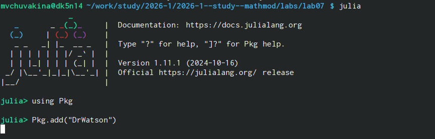
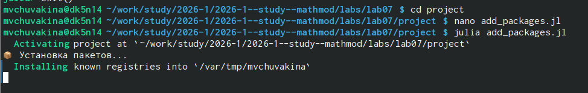
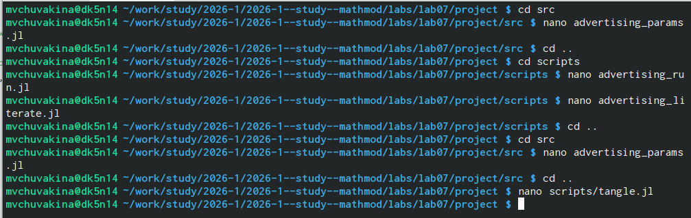

# Введение

Рассмотрим модель распространения рекламы о новом салоне красоты.
Предположим, что в районе проживает $N$ потенциальных клиентов.
На момент открытия о салоне знают $n_0$ человек.
После запуска рекламной кампании скорость изменения числа знающих
пропорциональна как числу знающих, так и числу не знающих о салоне.

Математическая модель описывается уравнением:

$$
\frac{dn}{dt} = (\alpha_1(t) + \alpha_2(t) \cdot n(t)) \cdot (N - n(t))
$$

где:
- $n(t)$ — число людей, знающих о салоне в момент времени $t$;
- $N$ — общее число потенциальных клиентов;
- $\alpha_1(t)$ — интенсивность платной рекламы;
- $\alpha_2(t)$ — интенсивность "сарафанного радио".

# Мой вариант

**Номер варианта: 56**

**Параметры модели:**
- $N = 1505$ — общее число потенциальных клиентов;
- $n_0 = 7$ — начальное число знающих;
- $\alpha_1 = 0.68$, $\alpha_2 = 0.00009$ — для случая 1 (платная реклама доминирует);
- $\alpha_1 = 0.00001$, $\alpha_2 = 0.28$ — для случая 2 (сарафанное радио доминирует);
- $\alpha_1(t) = 0.1\sin(5t)$, $\alpha_2(t) = 0.4\cos(3t)$ — для случая 3 (периодическая реклама).

# Теоретический анализ

## Модель Мальтуса

Модель Мальтуса описывает неограниченный экспоненциальный рост:

$$
\frac{dn}{dt} = \alpha n, \quad n(t) = n_0 e^{\alpha t}
$$

Используется для описания роста популяции в неограниченной среде,
начальных этапов распространения информации и других процессов
с положительной обратной связью.

## Логистическая кривая

Логистическое уравнение учитывает ограниченность ресурсов:

$$
\frac{dn}{dt} = \alpha n \left(1 - \frac{n}{N}\right)
$$

Описывает S-образный рост с выходом на стационарный уровень $N$,
что характерно для распространения информации в ограниченной аудитории.

## Модель распространения рекламы

Уравнение (1) объединяет оба механизма:
- Платная реклама ($\alpha_1$) создаёт постоянный "фон" информирования;
- Сарафанное радио ($\alpha_2 n$) ускоряет распространение по мере роста
  числа осведомлённых.

Коэффициенты влияют:
- $\alpha_1$ — на начальную скорость распространения;
- $\alpha_2$ — на нелинейное ускорение процесса.

# Подготовка рабочего пространства

- Создан каталог `mathmod/labs/lab07`

{#fig:001 width=70%}

- Создан проект DrWatson и установлены пакеты:
  `DifferentialEquations.jl`, `Plots.jl`, `LaTeXStrings.jl`
  
{#fig:001 width=70%}

{#fig:001 width=70%}

- Созданы скрипты для моделирования:
  - `advertising_run.jl` — основной скрипт;
  - `advertising_literate.jl` — литературная версия.
  
{#fig:001 width=70%}

# Результаты моделирования

## Случай 1: Платная реклама доминирует

Параметры: $\alpha_1 = 0.68$, $\alpha_2 = 0.00009$

{#fig:case1 width=100%}

**Анализ:**
- При доминировании платной рекламы информация распространяется
  равномерно, без заметного ускорения;
- Кривая имеет S-образный вид, близкий к классической логистической;
- Насыщение достигается примерно за 20 дней.

## Случай 2: Сарафанное радио доминирует

Параметры: $\alpha_1 = 0.00001$, $\alpha_2 = 0.28$

Динамика распространения информации при доминировании "сарафанного радио":

{#fig:case2 width=100%}

{#fig:velocity width=100%}

**Анализ:**
- При доминировании "сарафанного радио" наблюдается S-образная кривая
  с более резким переходом;
- **Максимальная скорость распространения достигается при $t \approx 11$ дней**;
- После точки перегиба скорость нарастает, затем убывает по мере насыщения.

## Сравнение эффективности рекламы

{#fig:comparison width=100%}

**Анализ:**
- Случай 1 ($\alpha_1 > \alpha_2$) — доминирование платной рекламы:
  - Более равномерный рост;
  - Позднее достижение насыщения.
- Случай 2 ($\alpha_1 < \alpha_2$) — доминирование "сарафанного радио":
  - Более быстрый рост в средней части;
  - Раннее достижение насыщения.

## Только платная и только бесплатная реклама

{#fig:paid_vs_word width=100%}

**Анализ:**
- Только платная реклама ($\alpha_2 = 0$) даёт линейно-экспоненциальный рост;
- Только "сарафанное радио" ($\alpha_1 = 0$) даёт более медленный старт,
  но быстрое ускорение;
- Комбинированный подход даёт наилучший результат.

# Анализ результатов

## Сравнительный анализ случаев

| Показатель | Случай 1 | Случай 2 |
|------------|----------|----------|
| $\alpha_1$ | 0.68 | 0.00001 |
| $\alpha_2$ | 0.00009 | 0.28 |
| Характер роста | Равномерный | S-образный с резким перегибом |
| Время достижения 50% | $\approx 12$ дней | $\approx 10$ дней |
| Время насыщения | $\approx 25$ дней | $\approx 18$ дней |
| Скорость в точке перегиба | Низкая | Высокая |

## Эффективность рекламной кампании

Для случая 2 (сарафанное радио доминирует) определена точка максимальной
эффективности: **$t_{\text{max}} \approx 11$ дней**.

В этот момент скорость распространения информации максимальна,
что соответствует точке перегиба S-образной кривой.

## Поведение модели при различных соотношениях коэффициентов

| Соотношение | Поведение |
|-------------|-----------|
| $\alpha_1 \gg \alpha_2$ | Преобладает платная реклама, рост близок к линейно-экспоненциальному |
| $\alpha_1 \ll \alpha_2$ | Преобладает "сарафанное радио", рост имеет явно выраженный S-образный характер |
| $\alpha_1 \approx \alpha_2$ | Смешанный тип, промежуточное поведение |

# Выводы

В ходе выполнения лабораторной работы:

1. **Реализована математическая модель распространения рекламы**
   для варианта №56 с параметрами:
   - $N = 1505$, $n_0 = 7$;
   - Три случая: платная реклама доминирует,
     сарафанное радио доминирует,
     периодическая реклама.

2. **Рассмотрены три случая** распространения информации:
   - Доминирование платной рекламы ($\alpha_1 = 0.68$, $\alpha_2 = 0.00009$);
   - Доминирование сарафанного радио ($\alpha_1 = 0.00001$, $\alpha_2 = 0.28$);
   - Периодическая реклама ($\alpha_1(t) = 0.1\sin(5t)$, $\alpha_2(t) = 0.4\cos(3t)$).

3. **Получены графики**:
   - Динамики числа знающих для всех трёх случаев;
   - Скорости распространения информации;
   - Сравнение эффективности различных подходов;
   - Сравнение только платной и только бесплатной рекламы.

4. **Проведён анализ**:
   - Определена точка максимальной эффективности рекламы
     ($t \approx 11$ дней для случая доминирования сарафанного радио);
   - Показано влияние коэффициентов на характер распространения.

5. **Освоены методы** численного решения дифференциальных уравнений
   в Julia с использованием пакета `DifferentialEquations.jl`.

6. **Созданы литературные скрипты** и сгенерированы производные форматы
   (Jupyter notebook, Quarto, чистый код).

# Список литературы {.unnumbered}

1. Королькова А.В., Кулябов Д.С. Имитационное моделирование. Практикум. — М.: РУДН, 2025. — 148 с.

2. Документация DifferentialEquations.jl: https://diffeq.sciml.ai/stable/

3. Документация Plots.jl: https://docs.juliaplots.org/

4. Документация DrWatson.jl: https://juliadynamics.github.io/DrWatson.jl/stable/

5. Документация Literate.jl: https://fredrikekre.github.io/Literate.jl/stable/
